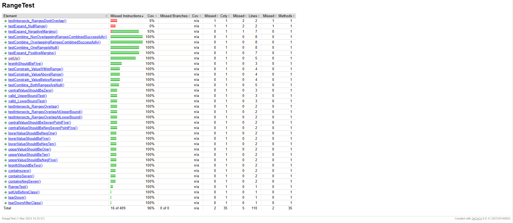
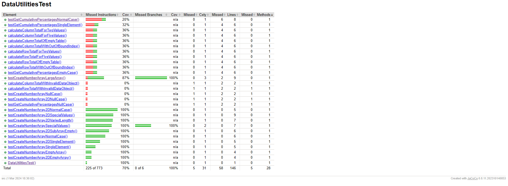
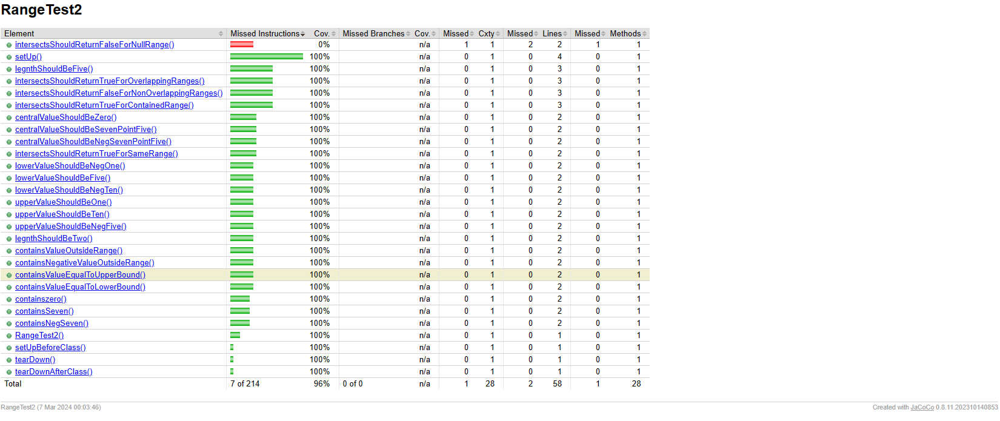

**SENG 438 - Software Testing, Reliability, and Quality**

**Lab. Report #3 – Code Coverage, Adequacy Criteria and Test Case Correlation**

| Group \#:         | 14  |
| --------------    | --- |
| Abhyudai Singh    |30157580|
| Akalumhe Eshilama |30140722|
| Emiko Emiko       |     |
| Marco Truong      | 30090441    |

(Note that some labs require individual reports while others require one report
for each group. Please see each lab document for details.)

# 1 Introduction

This laboratory introduced us to the principles and implementation of white-box testing. It involved using and extending our existing test suite. we also used new coverage metrics, such as statement and branch coverage. we devised new white-box test cases to enhance code coverage and evaluated the improvements in comparison to our initial implementation. Additionally, we examined the data-flow coverage of particular methods. 

By employing white box testing methodologies with coverage tools, we  achieve the following:
Verify the testing of all pathways, encompassing branches, loops, and exception handling.
Pinpoint the areas of the code that lack testing, allowing for more focused enhancements to the test suite.
Enhance the code's design and ease of maintenance.
Identify and rectify errors early in the development process.

# 2 Manual data-flow coverage calculations for X and Y methods

Text…

# 3 A detailed description of the testing strategy for the new unit test

To meet the coverage criteria outlined in the readMe, we added the following to the existing RangeTest suite from our A2:

Boundary Values for contains() Method:

- Test cases to include boundary values to ensure that the contains() method behaves correctly at the edges of the range.
- Test cases cover values equal to the lower and upper bounds of the range, as well as values just inside and outside the range boundaries.
- This approach helps ensure that the method handles boundary conditions correctly.

 New Test Cases for intersects Method:

- Test cases to verify the behavior of the intersects() method, which checks if the range intersects with another range.
- These test cases cover various scenarios, including overlapping ranges, non-overlapping ranges, a range contained within another range, and the case of a null range argument.
- By testing these different scenarios, the test suite aims to achieve branch coverage for the intersects() method. Thus increasing overall code coverage.

# 4 A high level description of five selected test cases you have designed using coverage information, and how they have increased code coverage

- **containsValueOutsideRange**: This test case checks if a value outside the range is correctly identified as not being contained within the range, thus ensuring condition coverage by exercising the 'false' condition in the contains method.

- **containsValueEqualToUpperBound**: Verifies that a value equal to the upper bound of the range is correctly identified as contained within the range, ensuring condition coverage by exercising the 'true' condition in the contains method.

-**intersectsShouldReturnTrueForOverlappingRanges**: Tests if the intersects method correctly identifies overlapping ranges, thereby increasing branch coverage by testing the 'true' branch of the intersects method.

- **intersectsShouldReturnFalseForNonOverlappingRanges**: Ensures that non-overlapping ranges are correctly identified, increasing branch coverage by testing the 'false' branch of the intersects method.

- **intersectsShouldReturnFalseForNullRange**: Tests the behavior of the intersects method when passed a null range, increasing branch coverage by exercising the condition where the argument range is null.

# 5 A detailed report of the coverage achieved of each class and method (a screen shot from the code cover results in green and red color would suffice)

Coverage Report of the Original Test classes 

Range test:   

DataUtilitiesTest:

Coverage Report of the Revised Test classes

Range test: 

DataUtilitiesTest:

# 6 Pros and Cons of coverage tools used and Metrics you report

COVERAGE TOOL USED : EclEmma

PROS: 
- As opposed to the other coverage tools, we found EclEmma easy to set up and integrate with the Eclipse IDE
- it provided various coverage metrics such as statement coverage, branch coverage which allowed us to asses the quality of our tests and make new tests to improve the coverage metrics.
- it provided a detailed report and outlined all the areas of the ode that weren't outlined by the code 

CONS: 
- the eclemma tool provided a coverage without the condition coverage

Statement Coverage Metric

PROS:
- it provided a basic measure of how much of the code has been executed by the test cases. 
- it was easy to understand and interpret

CONS: 
- it does not ensure that all possible execution paths in the code have been tested, 

Branch Coverage Metric

PROS: 
- it provided a more detailed measure of test coverage by evaluating whether all possible outcomes of various decision points in the code have been tested.

CONS: 
- it does not not guarantee comprehensive testing of all possible code paths, as it focuses on decision points rather then individual condition within the decisions

# 7 A comparison on the advantages and disadvantages of requirements-based test generation and coverage-based test generation.

Requirements-based test generation focuses directly on meeting the specified requirements, ensuring that the software behaves as intended. However if the requirements are incomplete or unclear, it may be challenging to generate comprehensive test cases, leading to gaps in test coverage. Coverage-based test generation aims to achieve high coverage metrics, ensuring that all parts of the code are executed during testing. Coverage-based testing may focus solely on achieving coverage metrics without considering whether the tests properly validate the specified requirements, potentially leading to gaps in test coverage.

# 8 A discussion on how the team work/effort was divided and managed

For this lab, only Eshilama had access to a working code coverage tool. Marco, Emiko and Abhyudai decided on test strategies and developed unit tests which were sent to eshi for coverage measurement. 

# 9 Any difficulties encountered, challenges overcome, and lessons learned from performing the lab

During this lab, some of our team members encountered difficulties with installing the code coverage software and libraries. We ran into unexpected errors, but in the end, we figured it out and got everything working. we also learned how to create test cases efficiently according to the needs of the code coverage. Designing these test cases was a hassle at first, but we figured it out as we got more experience with the tools.

# 10 Comments/feedback on the lab itself

Overall this lab was a really great first introduction into the practical application of whitebox testing and allowed us to learn many valuable lessons which definitely will come in handy in real world scenarios. This excersise also helped us work on our teamwork and learn how to communicate better!
